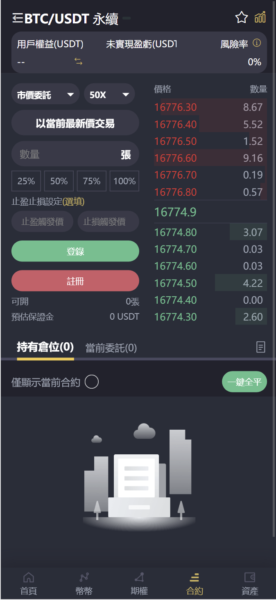

# 项目介绍
## 声明：
开源代码仅用于交流学习，参考开发，请勿用于非法途径
## 简介
### 1.系统说明
版本：2.1.2

本项目后端是基于PHP（Lavaral框架），前端 Uniapp 开发的比特币交易所 | BTC交易所 | ETH交易所 | 数字货币交易所 | USDT交易平台 | 自动撮合交易 | 合约交易 | 币币交易 | 期权交易 | 秒合约交易

<u>系统包含有15种语言: 英语，简体中文，繁体中文，韩文，日文，德文，意大利文，荷兰文，波兰文，葡萄牙文，西班牙文，瑞典文，土耳其文，乌克兰文</u>

##如果有疑问，可详询交流方式Telegram: @goldcoin007  

该项目有完整的系统组成部分，可用来搭建和二次开发数字货币交易所。
主要包括以下部分：  
**前端：** 
- 币币交易模块
- 期权交易模块
- 合约交易模块  
- 秒合约交易模块  
- 贵金属交易模块  
- 贵金属合约交易模块  
- 用户及注册邀请模块

**后端：**
- 总后台管理模块
- 代理后台管理模块
- 渠道商后台管理模块
- 自动化机器人模块
- K线管理模块

**目录文件说明：**
- assets 截图图片
- uniapp 前端代码
- backendcode 后台代码

### 2.系统技术构成及服务器配置建议
后端： PHP 7.2（Lavaral 框架）   
前端： VUE + Uniapp开发  
数据库：Mysql 5.7 、 Redis 6

服务器配置：
低配版本为8H16G，满足小型运营需求。
建议服务器配置为16H32G，能够极大提高承载量。
如果有需要更大的并发量，可做负载均衡模式，使用多台服务器进行配合，提供更好的服务。

##如果有疑问，可详询交流方式Telegram: @goldcoin007

### 3.前端预览
  
前端有暗夜黑和象牙白2个主题颜色，用户可自行切换，以下为前端预览。  

### 4.后台预览

## 部署说明

服务器系统建议使用Centos 7 

##如果有疑问，可详询交流方式Telegram: @goldcoin007

**1.PHP环境搭建**

建议使用版本7.2以上，PHP运行最大时长建议限制为300S。

**2.数据库，Redis服务搭建**

下载MYSQL 5.7安装

下载Redis 安装，版本建议使用Redis 6及以上

**3.网站配置**

网址指向到对应目录，配置Lavaral伪静态，修改.ENV的数据库账号密码和后端的域名地址

**4.安装对应依赖**

依赖文件为根目录下的composer.json，等待安装完毕后，即可进入网站后台

如需其他帮助可联系：Telegram: @goldcoin007
